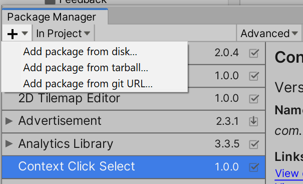
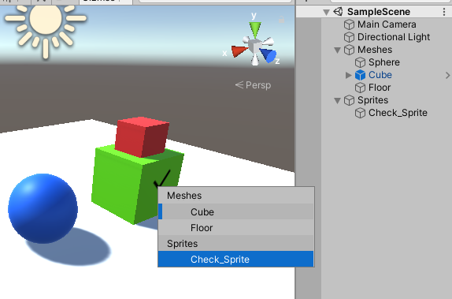

# Unity Context Click Select v2

A simple Unity tool to select objects from a dropdown using the secondary click, like in Photoshop.
This is a rework from the first version, using a custom dropdown instead of the native one, for better performance when having lots of objects or deep hierarchies.
Now it also has a scrollbar when there's too many objects to fit in the context menu.

## How to install

Download the latest ContextClickSelect package from Releases.

You can unzip the provided file on your "Packages" directory for embedding it into your project, or you can put it anywhere and just add it from package manager.
Also, you can add it with the git url: https://github.com/MatiM36/ContextClickSelectV2.git?path=/Packages/com.mati36.contextclickselect

### How to use

Just use right click over an object, and it will display a list of all the objects that are in that point, in their corresponding hierarchy.
It will mark the outermost prefabs with a line on the left side.

## Future ideas
- Show nested prefabs
- Enable more customization
- Add a search field?

Any ideas are welcome, just leave a message, and if you found it useful, please share!
